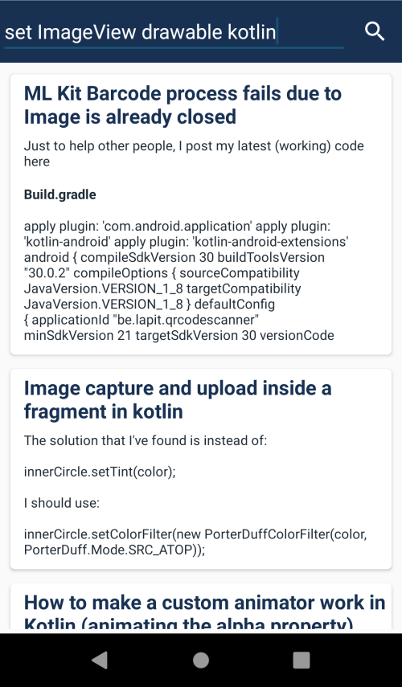

# StackOverflow Accepted Answer
a simple demo app that let u search StackOverflow for specific keyword, then it display a list of questions and its accepted answers

# please note:

this project is under developement

 

# features:
- uses StackOverflow api to get data.
- get only questions that has accepted answer

 

<!--
# Screenshots:

 

  
  
  

 

-->

# Tech Stack

- Kotlin

- Reactive Programming
    - RXjava
    - LiveData

- Other
    - View Binding
    - Gson

- Dependency Injection
    - dagger 2

- Networking
    - Retrofit
    - REST APIs / JSON
    
- Architecture
    - MVVM Architecture (ViewModel - UseCases - Model)
    - No Repository pattern
    
- SOLID

 

<!--
# TODO
- add Testing
    - Unit Tests
    - Instrumentation Tests
    - Mockito

 
-->

# License & Copyright
Copyright (c) 2022 **Muhammad-Ahmad**

 [MIT License](LICENSE)
